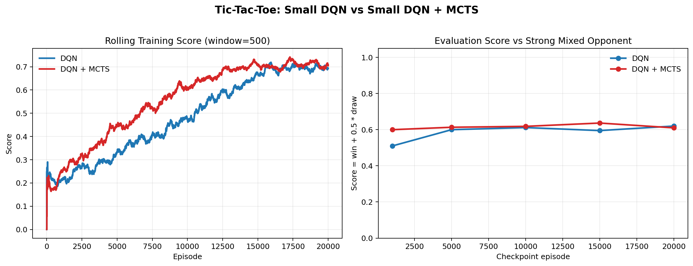
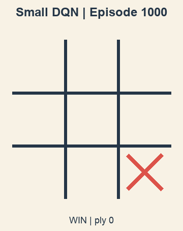
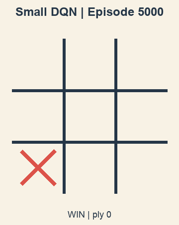
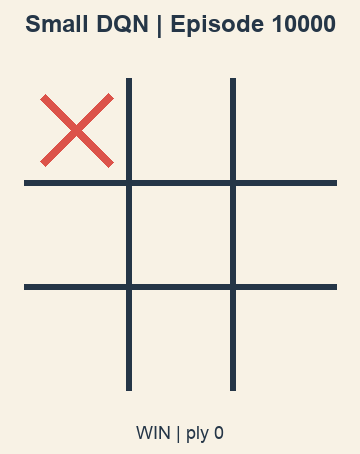
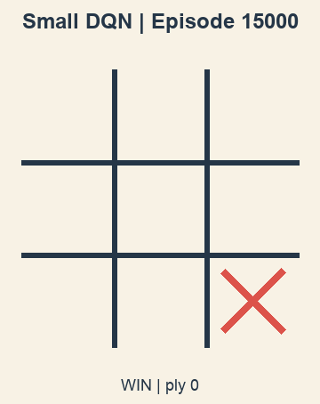
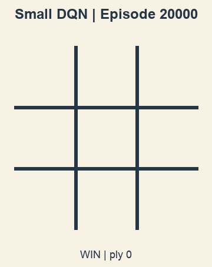

# Tic-Tac-Toe RL

This repository now contains two small neural agents for Tic-Tac-Toe:

- a plain DQN
- a DQN trained with MCTS-guided action selection

It also includes:

- a static browser demo that loads the exported model weights
- GitHub Pages deployment via GitHub Actions
- generated training plots and checkpoint GIFs for the README

Live site:

- [https://mudit1729.github.io/tictactoe-RL/](https://mudit1729.github.io/tictactoe-RL/)

## Current small-model results

Both runs use the same tiny MLP policy:

- input: `9`
- hidden: `32`
- hidden: `32`
- output: `9`

The training opponent is a mixed policy:

- `70%` minimax
- `30%` random

The evaluation opponent is stronger:

- `85%` minimax
- `15%` random

Score is defined as:

- win = `1.0`
- draw = `0.5`
- loss = `0.0`

| Run | Episodes | Final rolling train score (last 500) | Final eval score | Win rate | Draw rate | Loss rate |
| --- | ---: | ---: | ---: | ---: | ---: | ---: |
| Small DQN | 20,000 | 0.693 | 0.620 | 0.240 | 0.760 | 0.000 |
| Small DQN + MCTS | 20,000 | 0.708 | 0.610 | 0.237 | 0.747 | 0.017 |

What this means:

- the MCTS-guided run learned slightly faster in training
- final evaluation is effectively comparable on this small game
- both agents converge to strong non-losing play against a mostly optimal opponent



## Checkpoint GIFs

These checkpoint GIFs come from the plain DQN run.

### 1k episodes



### 5k episodes



### 10k episodes



### 15k episodes



### 20k episodes



## Browser demo

The browser demo lives in [`docs/index.html`](docs/index.html) and loads exported JSON weights from [`docs/models/`](docs/models/).

Notes:

- it is a static site, so there is no backend
- the default model is the stronger `DQN + MCTS-trained` policy network
- for responsiveness, the browser runs direct policy inference from the exported network weights
- the training-time search itself is not replayed in the browser

The UI lets you:

- choose between the plain DQN and the DQN+MCTS-trained network
- decide whether you or the AI move first
- play repeated games directly in GitHub Pages

## Training pipeline

The main experiment script is [`train_and_visualize.py`](train_and_visualize.py).

It does all of the following:

- trains the small DQN run
- trains the small DQN+MCTS run
- saves checkpoints at `1000`, `5000`, `10000`, `15000`, and `20000`
- writes metrics JSON to `outputs/`
- exports TensorBoard logs to `logs/tensorboard/`
- generates the README plot and GIF assets in `docs/assets/`
- exports browser model weights to `docs/models/`

Run it with:

```bash
python -m venv .venv
source .venv/bin/activate
pip install -r requirements.txt
python train_and_visualize.py
```

## TensorBoard

Point TensorBoard at the generated log root:

```bash
tensorboard --logdir logs/tensorboard
```

Run names:

- `dqn_small`
- `dqn_mcts_small`

Useful tags:

- `train/episode_score`
- `train/episode_reward`
- `train/epsilon`
- `train/avg_score_running`
- `train/avg_score_500`
- `eval/score`
- `eval/win_rate`
- `eval/draw_rate`
- `eval/loss_rate`

## Repository layout

```text
tictactoe/
  agent.py          # original tabular agents
  game.py           # original CLI game
  dqn_rl.py         # tiny DQN implementation
  mcts_rl.py        # MCTS planner for training/eval
  rl_core.py        # board logic, policies, rendering
docs/
  index.html        # GitHub Pages app
  app.js            # browser inference + gameplay
  styles.css
  assets/
  models/
train_and_visualize.py
play.py
gui/game_gui.py
```

## Deployment

GitHub Pages deployment is automated by:

- [`.github/workflows/pages.yml`](.github/workflows/pages.yml)

The workflow uploads `docs/` as the static site artifact on pushes to `main`.

## Legacy tabular project files

The original repository contents are still here:

- tabular Q-learning and SARSA in [`tictactoe/agent.py`](tictactoe/agent.py)
- the original terminal trainer in [`play.py`](play.py)
- the Tkinter GUI in [`gui/game_gui.py`](gui/game_gui.py)

The new DQN/MCTS work is additive; it does not delete the original implementation.
